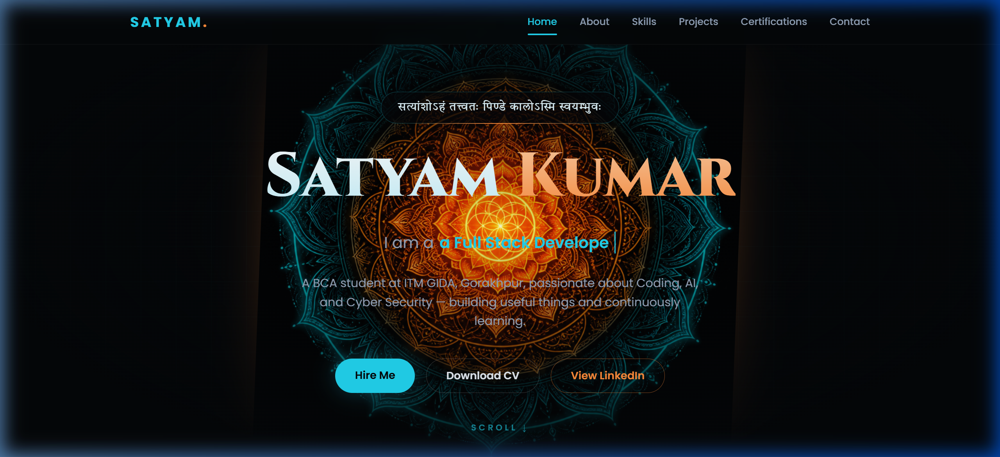
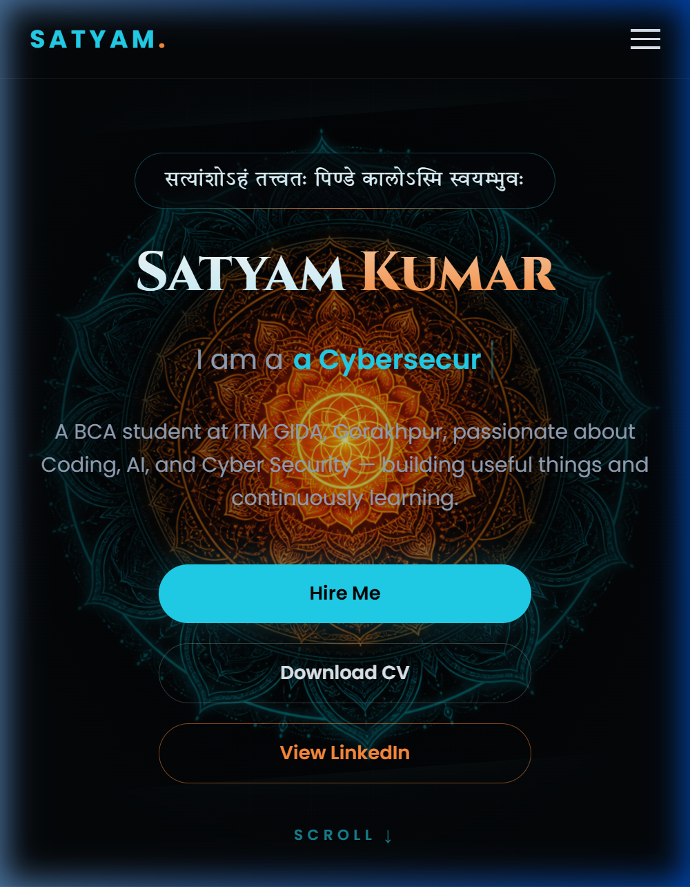

# 🌑 ShadowFox Internship Tasks — Satyam Kumar

> Web Development Internship Tasks submitted to **ShadowFox** by **Satyam Kumar**

[](https://github.com/oyeeesatyam)
[](https://linkedin.com/in/oyeeesatyam)
[](https://satyam-portfolio-sand-nine.vercel.app)
[](https://shadow-mart.vercel.app)

---

## 🔗 Live Demo Links

| Task | Live URL | Description |
|------|----------|-------------|
| 🧑‍💻 Task 1 — Portfolio | **[satyam-portfolio-sand-nine.vercel.app](https://satyam-portfolio-sand-nine.vercel.app)** | Personal Portfolio Website |
| 🛒 Task 2 — Ecommerce | **[shadow-mart.vercel.app](https://shadow-mart.vercel.app)** | Shadow Mart E-Commerce Storefront |

---

## 📁 Repository Structure

```
ShadowFox/
│
├── README.md                        # Project Overview (this file)
│
├── Task-1-Portfolio/                # Task 1: Personal Portfolio
│   ├── index.html                   # Portfolio core layout
│   ├── style.css                    # Custom variables & animations
│   ├── script.js                    # Typewriter and scrolling logic
│   ├── resume.pdf                   # CV/Resume PDF document
│   ├── favicon.png                  # Customized logo icon
│   ├── vercel.json                  # Vercel deployment config
│   └── assets/                      # Portfolio design assets & certification preview images
│
└── Task-2-Ecommerce/                # Task 2: E-commerce Website
    ├── index.html                   # Main storefront layout
    ├── README.md                    # Task 2 detailed documentation
    ├── vercel.json                  # Vercel deployment config
    ├── css/
    │   └── style.css                # Design tokens, themes & animations
    └── js/
        ├── products.js              # Mock product database (40+ items)
        ├── filters.js               # Filtering, sorting & URL sync
        ├── cart.js                  # Cart, wishlist & LocalStorage
        ├── checkout.js              # 5-step checkout controller
        └── main.js                  # Core UI orchestrator
```

---

## 🏆 Task 1: Personal Portfolio

A premium, modern personal portfolio website built with **HTML5**, **CSS3**, and **JavaScript**.

### ✅ Checklist
- [x] Responsive design (Mobile, Tablet, Desktop)
- [x] All buttons and links functional
- [x] Resume/CV download button works
- [x] Live demo on Vercel
- [x] Firebase contact form integration
- [x] 20+ Certifications with live preview images

### 🌟 Key Features
- **Chakra Background Animation**: Custom mouse-tracking glow and spin-slow mandala effect
- **Interactive UI**: Sleek typewriter effects, scroll cues, and responsive navbar highlighting
- **Certifications Grid**: Displays 20 certifications complete with real live preview images and hover transitions
- **Firebase Integration**: Contact form submissions are synchronized live to a Cloud Firestore database
- **Visual Popups**: Powered by SweetAlert2 for sleek message success dialogs
- **Resume Download**: Direct PDF download button in hero section

### 🖥️ Screenshots

| Desktop View | Mobile View |
|---|---|
|  |  |

### 🚀 Live Demo
🔗 **[https://satyam-portfolio-sand-nine.vercel.app](https://satyam-portfolio-sand-nine.vercel.app)**

### How to Run Locally
1. Navigate into `Task-1-Portfolio/`
2. Open `index.html` in your browser (or use Live Server)

---

## 🛒 Task 2: E-Commerce Storefront (Shadow Mart)

A premium, fully-functional e-commerce storefront demo built entirely with **plain HTML5, CSS3, and modular Vanilla JavaScript (ES6+)**.

### ✅ Checklist
- [x] Responsive design (Mobile, Tablet, Desktop)
- [x] All buttons and links functional
- [x] Filter, Sort, Cart, Wishlist all working
- [x] 5-Step Checkout wizard complete
- [x] LocalStorage persistence
- [x] Dark/Light theme toggle
- [x] Live demo on Vercel

### 🌟 Key Features
- **Advanced Filtering & Sorting**: Multi-select categories, dual price range slider, color/size swatches, rating filters, and shareable URL state sync
- **Grid & List Layouts**: Instant toggle between card grid and list view with smart sorting (relevance, price, rating, newest, best seller)
- **Interactive Shopping Cart Drawer**: Real-time cart badges, wishlist, save-for-later, and full LocalStorage persistence
- **5-Step Checkout Wizard**: Cart review → Shipping → Payment (Card/UPI/COD) → Order review → Confirmation with order ID
- **Premium UX**: Sub-300ms micro-animations, light/dark theme toggle, and skeleton loaders
- **Promo Code**: Use `SAVE10` at checkout for a 10% discount

### Tech Stack

| Layer | Technology |
| :--- | :--- |
| Markup | HTML5 (Semantic, ARIA) |
| Styling | CSS3 (Design System, Grid, Flexbox, Themes) |
| Logic | Vanilla JS ES6+ (Modular) |
| Storage | LocalStorage / SessionStorage |
| Fonts & Icons | Google Fonts / Lucide Icons (CDN) |

### 🚀 Live Demo
🔗 **[https://shadow-mart.vercel.app](https://shadow-mart.vercel.app)**

### How to Run Locally
1. Navigate into `Task-2-Ecommerce/`
2. Open `index.html` in your browser (or use Live Server)

---

## 👤 About the Author

**Satyam Kumar**
- 🎓 BCA Student at ITM GIDA, Gorakhpur (Affiliated to DDU Gorakhpur University)
- 💼 LinkedIn: [linkedin.com/in/oyeeesatyam](https://linkedin.com/in/oyeeesatyam)
- 🐙 GitHub: [github.com/oyeeesatyam](https://github.com/oyeeesatyam)
- 🌐 Personal Portfolio: [oyeeesatyam.in](https://oyeeesatyam.in)
- 📧 Email: oyeeesatyam@gmail.com

---

*Internship Tasks by Satyam Kumar — ShadowFox Web Development Internship 2026.*
